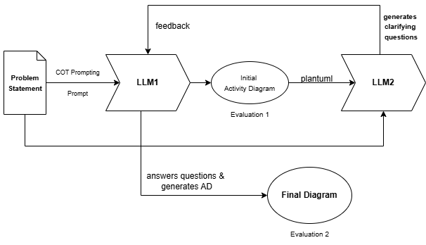
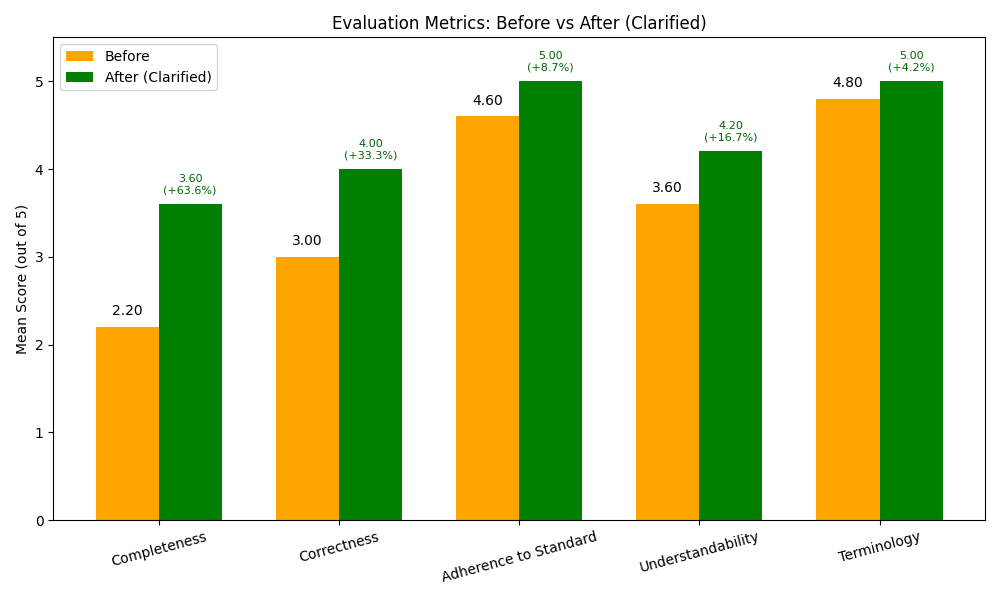

# 🚀 Automated UML Activity Diagram Generation using LLMs

This research project explores a prompt-based pipeline for automatically generating **UML Activity Diagrams** from natural language requirements using **Large Language Models (LLMs)**.

> 📅 *Minor Research Project — M.Tech (Jan–May 2025)*  
> 👨‍🏫 *Mentor: Saurabh Tiwari*  
> 🧑‍💻 *Author: Vrajkumar Patel*

---

## 📌 Project Overview

Manually creating UML Activity Diagrams is time-consuming, error-prone, and requires domain expertise. This project presents a **model-agnostic pipeline** that combines:

- **Chain-of-Thought prompting** for structured reasoning
- **ClarifyGPT-style refinement** using an Evaluator LLM
- **PlantUML script generation** for visual output
- **Quantitative and qualitative evaluation** for measuring improvement

---

## 🛠️ Tech Stack

- 🧠 Large Language Models: Gemini 1.5 Flash, LLaMA 3.2  
- 🧪 Prompt Engineering: Chain-of-Thought (CoT), ClarifyGPT-style evaluation  
- 🖋️ Scripting & IDEs: Python, Jupyter Notebook, VS Code  
- 📊 Evaluation: Manual scoring, t-test statistical analysis  
- 🎨 Diagram Rendering: PlantUML  
- 🧪 Experiment Tools: RStudio, Ollama, Git  

---
## 🧭 Methodology

This project combines Chain-of-Thought reasoning and a ClarifyGPT-inspired evaluation loop to iteratively refine UML Activity Diagrams generated from natural language descriptions.

  

---

## 🔄 Workflow

1. **Input**: Natural Language problem statement  
2. **LLM Processing**:
   - Action & control flow extraction (via CoT)
   - Initial diagram generation (PlantUML script)  
3. **Evaluator Loop**:
   - LLaMA 3.2 generates clarifying questions  
   - Responses used to regenerate a refined diagram  
4. **Output**:
   - Final refined diagram with improved correctness and completeness  
5. **Evaluation**:
   - Scored across 5 dimensions: Completeness, Correctness, Standards, Terminology, Understandability

---

## 📈 Results Summary

The ClarifyGPT-enhanced pipeline showed consistent improvements in diagram quality across three real-world problem statements.

  

| Metric              | Before (Mean) | After (Mean) | % Improvement | Significance |
|---------------------|----------------|---------------|----------------|---------------|
| Completeness        | 2.2            | 3.6           | +63.6%         | ✅ Significant |
| Correctness         | 3.0            | 4.0           | +33.3%         | ✅ Significant |
| Standards Adherence | 4.6            | 5.0           | +8.7%          | ❌ Not Sig.    |
| Understandability   | 3.6            | 4.2           | +16.7%         | ❌ Not Sig.    |
| Terminology         | 4.8            | 5.0           | +4.2%          | ❌ Not Sig.    |

---
## 📄 Resources

- 📑 **Final Report:** [docs/final_report.pdf](docs/final_report.pdf)
- 🎤 **Presentation Slides:** [docs/presentation_slides.pdf](docs/presentation_slides.pdf)

---

## 🔍 Research Questions

- **RQ1:** What is the quality of Activity Diagrams generated by LLMs from natural language input?
- **RQ2:** What common modeling issues occur, and how can clarifying questions resolve them?

---

## 📜 References

- 📄 *ClarifyGPT: A framework for enhancing LLM-based code generation via requirements clarification*
- 📄 *Model Generation with LLMs: From Requirements to UML Diagrams*
- 📘 [PlantUML Official Documentation](https://plantuml.com/activity-diagram)

---

## 🤝 Contributions

This research was independently conducted as part of the **M.Tech Research Project** (Jan–May 2025).  
Pull requests and suggestions to extend this work to other UML diagram types (e.g., Class Diagrams, State Machines) are welcome!

---

## 📬 Contact

For queries or collaboration opportunities:

📧 **31vrajpatel@gmail.com**

---
